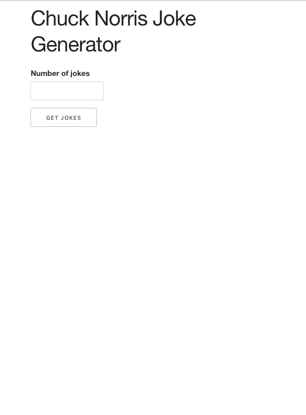

# Chuck Norris Joke Generator - external API call

Fetching data from an external API using Ajax. Here using the Chuck Norris jokes API (www.icndb.com/api).

The user inputs the number of jokes to be requested and the random jokes are fetched and shown to the user.

Skeleton is used for styling.

## A screenshot

On desktop

## Author
* Albert Stjärne (https://github.com/AlbertStjarne)